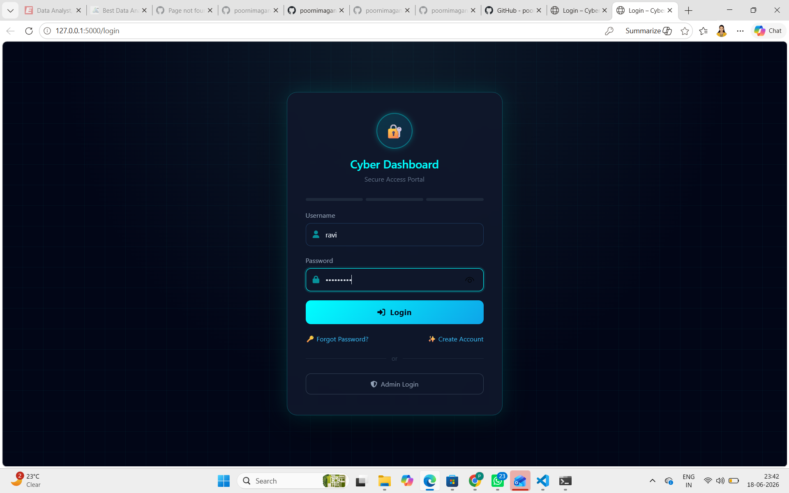
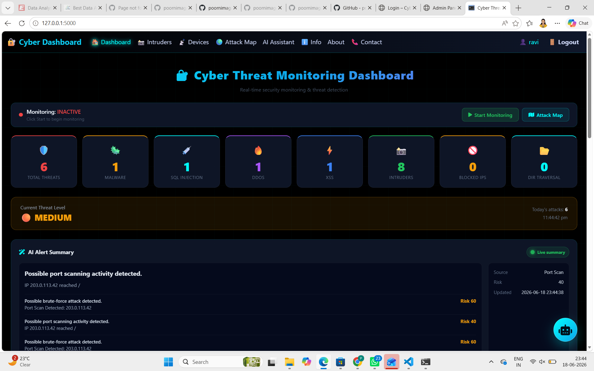
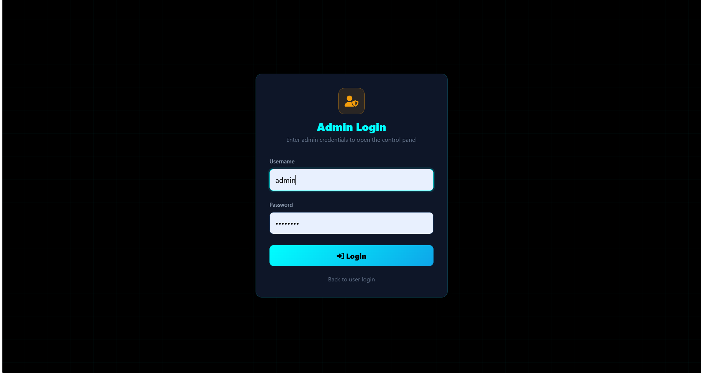
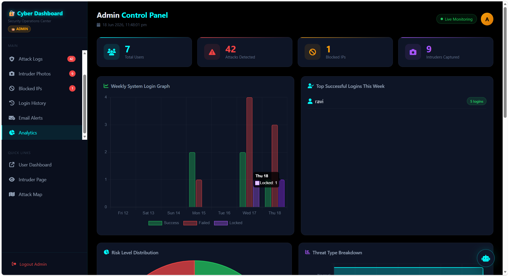
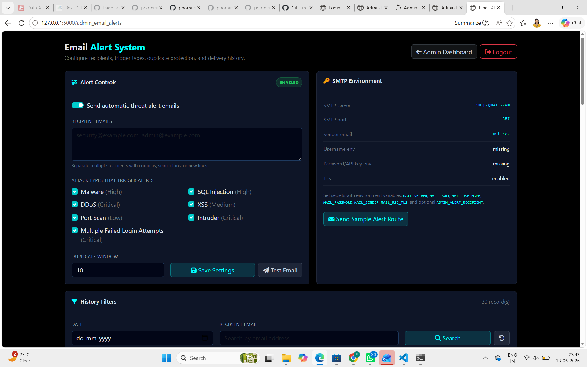
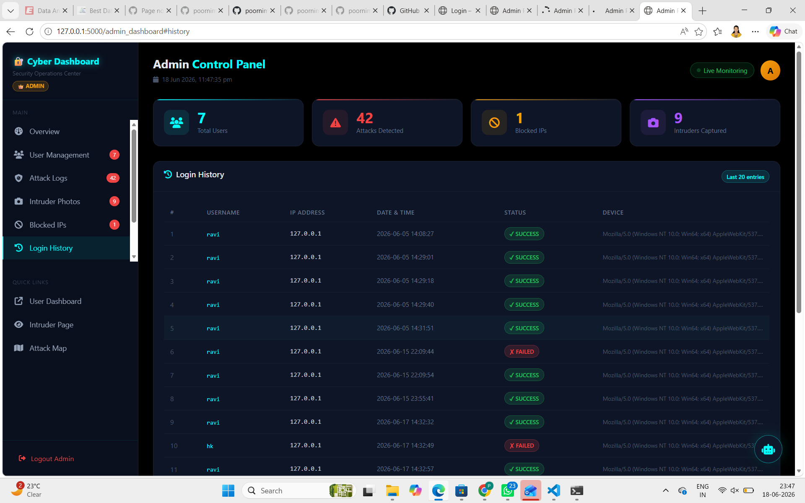
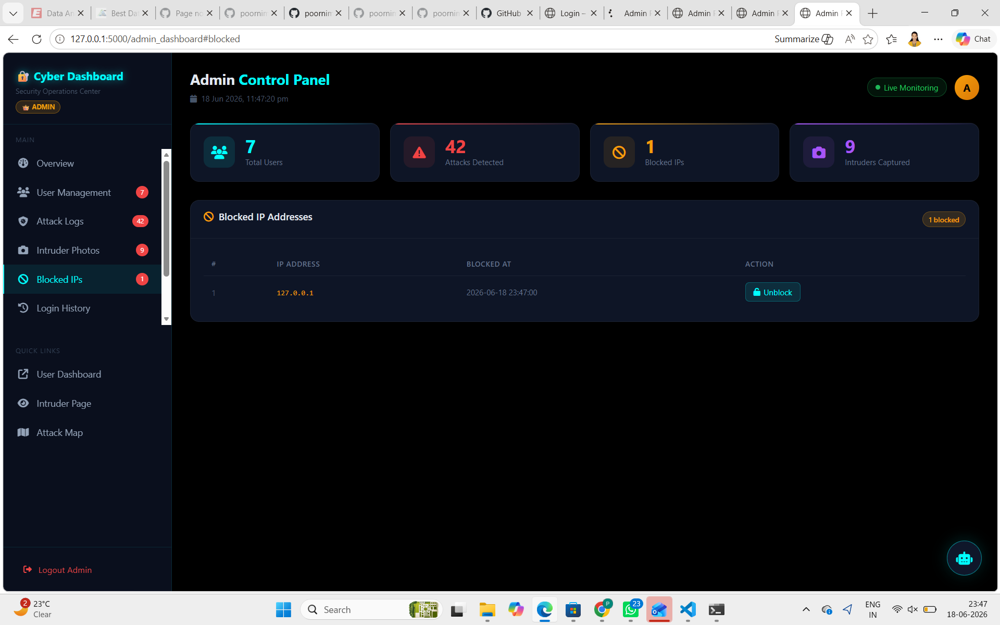
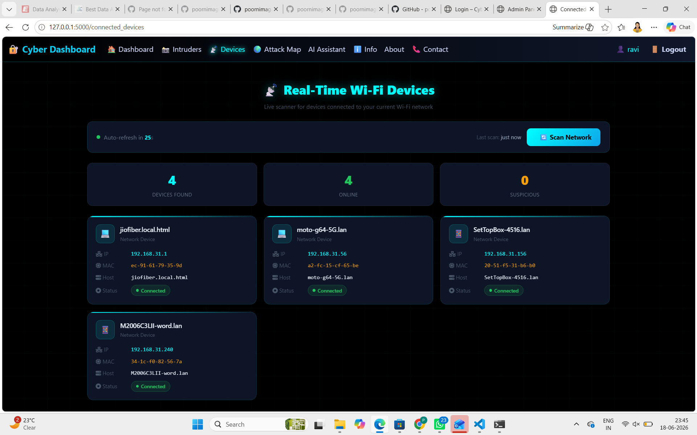
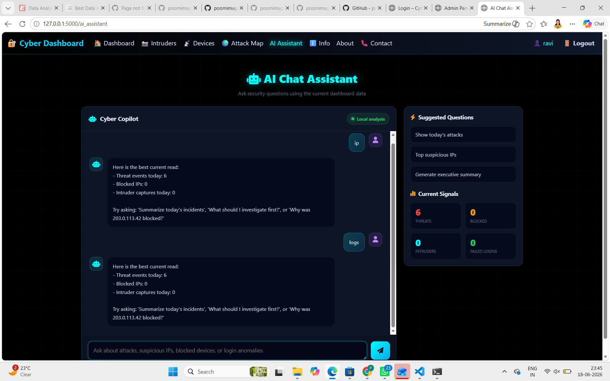
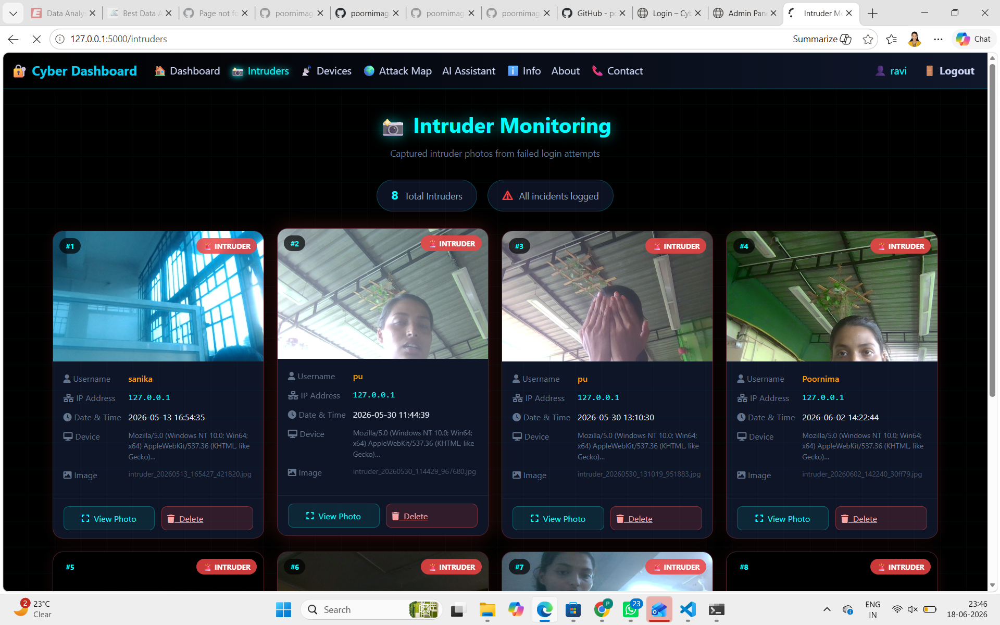

#  AI-Enhanced Cyber Threat Monitoring & Intrusion Detection System

A real-time **AI-powered Cyber Security Monitoring System** designed to detect, analyze, and respond to suspicious network activity using **Machine Learning, Flask, and SQLite**.  
The system provides centralized security monitoring, automated alerts, and administrative control for threat management.

---

## 🚀 Key Features

- 🔐 Secure Authentication System (Login & Session Management)
- 🧠 Machine Learning-Based Intrusion Detection
- 🚨 Real-Time Alert Generation (Email Notifications)
- 📊 Security Analytics Dashboard
- 📜 User Login Activity & History Tracking
- 🛑 IP Monitoring & Blocking Mechanism
- 📡 Device & Network Traffic Scanning
- 👤 Admin Control Panel
- 🤖 AI Chatbot Support Module
- 🖼️ Web Image Scan Analysis Module
- 📈 Real-Time System Monitoring Dashboard

---

## 🏗️ Technology Stack

- **Frontend:** HTML5, CSS3, Bootstrap
- **Backend:** Python (Flask Framework)
- **Database:** SQLite
- **Machine Learning:** Scikit-learn / Trained Classification Model
- **Security Modules:** Logging, Email Alert System, IP Filtering

---

---

## 📸 System Interface

### 🔐 Login Interface
[](screenshot/loginpage.png)

### 🏠 Security Dashboard
[](screenshot/dashboard.png)

### 👤 Administration Panel
[](screenshot/adminpage.png)

### 📊 Security Analytics
[](screenshot/admin analytics .png)

### 🚨 Alert Notification System
[](screenshot/Email alert.png)

### 📜 Authentication Logs
[](screenshot/Login history.png)

### 🛑 Threat IP Management
[](screenshot/blockedIP.png)

### 📡 Network & Device Scanning
[](screenshot/devicescaning.png)

### 🧠 AI Security Assistant
[](screenshot/AIchtbot.png)

### 🖼️ Web Activity Analysis
[](screenshot/webcanscannedimages.png)

---

## ⚙️ Installation & Setup

```bash
# Clone repository
git clone https://github.com/your-username/project-name.git

# Navigate to project directory
cd project-name

# Install dependencies
pip install -r requirements.txt

# Run application
python app.py

